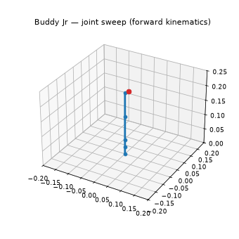
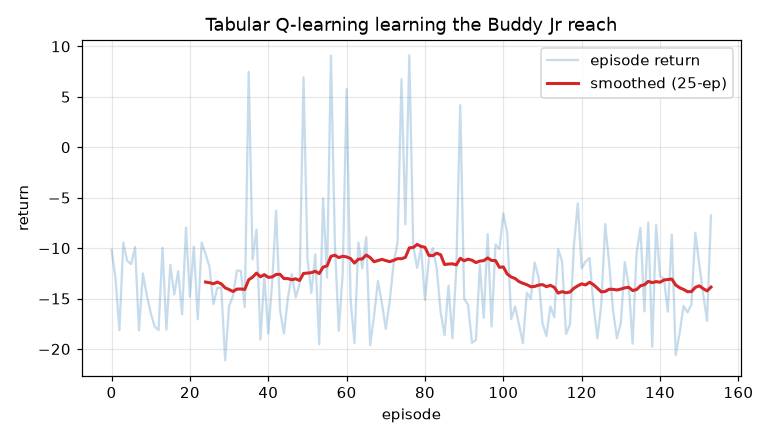

# Buddy Jr RL Lab

A **reinforcement-learning simulation and learning lab** built around the
[Buddy Jr](https://www.kevsrobots.com/blog/buddy_jr.html) 4-DOF robot arm. You
experiment in a 3D simulator, *watch* a policy learn live, and work through a
progressive ladder of twelve experiments — from "what is a reward?" all the way
to deploying a trained policy on real SG90 servos.

{ width="320" }
{ width="380" }

## Start here

- **[Install on macOS](getting_started/installation_macos.md)** — Python 3.12 venv + the default stack.
- **[Foxglove setup](getting_started/foxglove_setup.md)** — see the arm move in 3D.
- **[The experiment ladder](experiments.md)** — the twelve lessons, in order.
- **[Troubleshooting / FAQ](troubleshooting.md)** — when something goes sideways.

## What's inside

| Layer | What it is |
|-------|------------|
| **Robot** | The Buddy Jr URDF, [kinematics](robot/kinematics.md) (FK + law-of-cosines IK), and [frames](robot/frames.md). |
| **Sim** | A `SimBackend` interface: a physics-free `KinematicBackend` (default), PyBullet, or MuJoCo. |
| **Env** | Gymnasium environments (`BuddyJrReach-v0`, `…Discrete-v0`, `…CameraPoint-v0`). |
| **Algorithms** | From-scratch Q-learning/SARSA/DQN/REINFORCE/PPO, plus Stable-Baselines3 PPO/SAC/TD3/DDPG. |
| **Viz** | Live [Foxglove](getting_started/foxglove_setup.md) streaming + MCAP recording. |
| **Deploy** | Export a policy and run inference on a Raspberry Pi 5 driving the servos. |

## The learning path

The [concept primers](concepts/mdps.md) explain the ideas; each links to the
experiment that makes it concrete. New here? Read
[Install on macOS](getting_started/installation_macos.md), then run
[Experiment 02 — Build the world](experiments/02_world.md) to see the arm, then
[Experiment 01 — Bandit base](experiments/01_bandit.md) for your first taste of
RL.

Built by Kevin McAleer — [kevsrobots.com](https://www.kevsrobots.com). MIT licensed.
